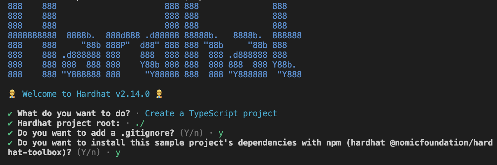

# ブロックチェーンを用いたWeb開発（基本編）
ブロックチェーンを用いたWeb開発において，どのようにスマートコントラクトをチェーン上にデプロイし，フロントエンドからアクセスし，利用するかはとても大切な基本です．2023年10月現在，Solidityのバージョン，様々な開発ツール，そして，フロントエンドでどのフレームワークを選ぶかの組み合わせが多く存在し，そして情報の新旧に惑さわれ，学習スピードが落ちるということが懸念される．そこで，こちらで設定した環境下において，簡単な一例をを元にバックからフロントまで一貫した開発を行うことで，一連の開発の流れを理解することを目指す．


### 対象者
・対象者は，プログラミングの基本（ループ，変数，関数などといった知識）を知っている．
・VSCodeをインストール済み


## コンテンツ
---
1. [環境構築](#環境構築)
2. [バックエンドの作成](#バックエンドの作成)
	1. 作業ディレクトリの作成
	2. Hardhatのインストール
	3. [スマートコントラクトの作成](#3.スマートコントラクトの作成)
		1. [コーディング](3.1.コーディング)
		2. [スマートコントラクトのテスト](#3.2.スマートコントラクトのテスト)
	4. [Hardhatを使用してブロックチェーンにデプロイ](#4.Hardhatを使用してブロックチェーンにデプロイ)
3. [フロントエンドの作成](#フロントエンドの作成)


## 環境構築
---
- 下記からNodeをダウンロードしインストール．
    [Node.js 18.17](https://nodejs.org/) or later.
- Solidity (VSCode Extensionのインストール)　下記画像参考
![[20231027214905.png]]

## バックエンドの作成
---
### 1. 作業ディレクトリを作る

1. `mkdir my-web3`ディレクトリ作成
2. `cd my-web3` 作成したディレクトリに移動
### 2.Hardhatのイントール

1. `mkdir hardhat` さらにディレクトリを作成
2. `cd hardhat` 作成したディレクトリに移動
3. `npx hardhat init` ハードハットをインストール
以下のように設定



これにてインストール完了．
### 3.スマートコントラクトの作成
1. `cd contract` スマートコントラクトを作成するディレクトリへ移動
2. ファイルを”mysample.sol” という名前で作成
### 3.1.コーディング

```
// SPDX-License-Identifier: GPL-3.0

pragma solidity 0.8.21;

import "@openzeppelin/contracts/token/ERC20/ERC20.sol";

  

//Changed class name to AizuMujinToken

contract Myexample is ERC20 {

mapping(address => mapping(address => uint256)) private _allowances;

mapping(address => uint256) private _balances;

uint256 private _totalSupply;

  

string private _name;

string private _symbol;

address private _owner;

//アクセスコントロール用の修飾子を自作

modifier onlyOwner() {

require(msg.sender == _owner);

_;

}

// @title　コントラクターが呼び出された際に同時にミントも行わせる

// @author Komeda

// @dev 通常のコントラクターの処理に加え，Mint（トークン発行）も行う

// @param name_ トークンの名前（例　日本円）

// @param symbol_ トークンのシンボル（例　￥）

constructor(string memory name_, string memory symbol_) ERC20(name_,symbol_) {

_name = name_;

_symbol = symbol_;

_owner = msg.sender;

}

  

function myMint(uint256 ammount) external onlyOwner{

_mint(msg.sender, ammount);

_transfer(msg.sender, address(this), ammount);

}

// @title 1トークンを要求する

// @author Komeda

// @dev 1トークンをファンクションを呼び出したものに対して送金

function faucet() public{

require(getAddBalance(address(this)) > 0);//コントラクトに資金あるか

_transfer(address(this), msg.sender, 1);

}

// @title アカウントのトークン数参照

// @author Komeda

// @dev アカウントのトークン数参照

// @param account はアドレスとして使用

// @return アカウントに紐づいた現在所有しているトークン数

function getMyBalance() public view returns(uint256){

return balanceOf(msg.sender);

}

function getAddBalance(address add) public view returns(uint256){

return balanceOf(add);

}

// @title　シンボルの取得

// @author Komeda

// @dev シンボルの取得

// @return オブジェクト生成時に設定したトークンのシンボルを取得

function symbol() public view override returns (string memory) {

return _symbol;

}

  

function decimals() public view virtual override returns (uint8) {

return 0;

}

}
```
### 3.2.スマートコントラクトのテスト

作業ディレクトリを`test`へ移動します.

`cd ../test`

`test`ディレクトリ内で，`mysample.ts`というTypescriptファイルを作成し，下記を参考にしてファイルを完成させてください・

**Tips**
	インタラクティブにスマートコントラクトの機能だけをテストする場合，
	[Remix](https://remix.ethereum.org/)を使用すると非常に便利です．
	今回はRemixでのテスト以外に，Hardhatでできるテストを行います．
	少し複雑となりますが，Typescriptを使用して，実際にWebからブロックチェーンの接続をする時に似ていますので，参考になると思います．また，プログラマブルにテストも行えるようになるので慣れておくといいでしょう．

```
import { ethers } from "hardhat";

  

describe("Myexample", function(){

async function deployContract(){

// Signerと呼ばれる，秘密鍵で通信している人の情報を取得

const [owner, otherAccount] = await ethers.getSigners();

  

//deployed using the info based on hardhat.config.ts

const preContract = await ethers.getContractFactory("Myexample");

const contract = await preContract.deploy("AWTS","T");

console.log("owner.address\t: \t", owner.address);

console.log("contract.address: \t", contract.address);

return{owner , contract};

}

it("デプロイテスト", async function(){

await deployContract();

});

  

it("機能テスト: \n\tトークン発行，\n\tコントラクトの残高確認, \n\tトークンの送金テスト, \n\t自分の残高確認", async function () {

const {owner, contract} = await deployContract();

//トークンの発行およびテスト

console.log("トークン発行テスト");

await contract.myMint(1000000);

const ammount = await contract.getAddBalance(contract.address);

console.log("コントラクトの残高確認");

console.log(ammount + " " +await contract.symbol());

console.log("トークンの送金テスト");

await contract.faucet()

console.log("OK")

console.log("自分の残高確認");

console.log(Number(await contract.getMyBalance()) + await contract.symbol());

await contract.faucet();

});

});
```

次にテストを実行します．次のコマンドは必ず`hardhat`ディレクトリ内で行ってください．

`npx hardhat test`

テストが完了すると次のような画面が現れます．

![[Pasted image 20231027220149.png]]

上記の画面が出れば成功です．
Lockと書かれている記述部分はサンプルファイルのものも同時にテストしているからです．

**Caution**
	次のような画面が出た場合はNodeのバージョンがHardhatに対応していません．
	
![[20231027220016.png]]
	次のコマンドを使用して，バージョンを合わせてください．
	
	`nvm use 18`

### 4.Hardhatを使用してブロックチェーンにデプロイ

ここまできたら，あと少しでスマートコントラクトをデプロイすることができます．
本来であれば，ここで`hardhat.config.ts`ファイルを編集して，チェーンの選択などを行いデプロイすることができますが，今回はGitに上がっているものをそのままコピーしてください．デプロイと思ってください．

では`hardhat`ディレクトリ直下の`scripts`へ移動し`deploy.ts`ファイルを作成してください．
おそらくすでにサンプルのものがありますので，そちらを下記のコードスニペットを参考に変更してください．

```
import { ethers } from "hardhat";

  

async function main() {

// Signerと呼ばれる，秘密鍵で通信している人の情報を取得

const [owner, otherAccount] = await ethers.getSigners();

  

//deployed using the info based on hardhat.config.ts

const preContract = await ethers.getContractFactory("Myexample");

const contract = await preContract.deploy("AWTS","T");

console.log("owner.address\t: \t", owner.address);

console.log("contract.address: \t", contract.address);

  

await contract.myMint(1000000);

}

  

// We recommend this pattern to be able to use async/await everywhere

// and properly handle errors.

main().catch((error) => {

console.error(error);

process.exitCode = 1;

});
```

完成したら今回はLiveチェーンではなく，ローカルにデプロイしてみます．
プロンプトを二つ開いて片方で下記コマンドを実行してください．ローカル上にチェーンを展開することができます．

`npx hardhat node`

次に，もう片方のプロンプトで，次のコマンドを実行してください．これがデプロイコマンドとなります．

`npx hardhat run scripts/deploy.ts --network localhost`

次の画面が出たらデプロイが完了です．

![[20231027224340.png]]

お疲れ様でした．次回はシンプルなフロントエンドを作成し，実際にフロントから接続できるかを検証します．
## フロントエンドの作成
---
## 3) Next.jsをインストール

1. `npx create-next-app@latest`

2. 設定を聞かれるので次のようにする

